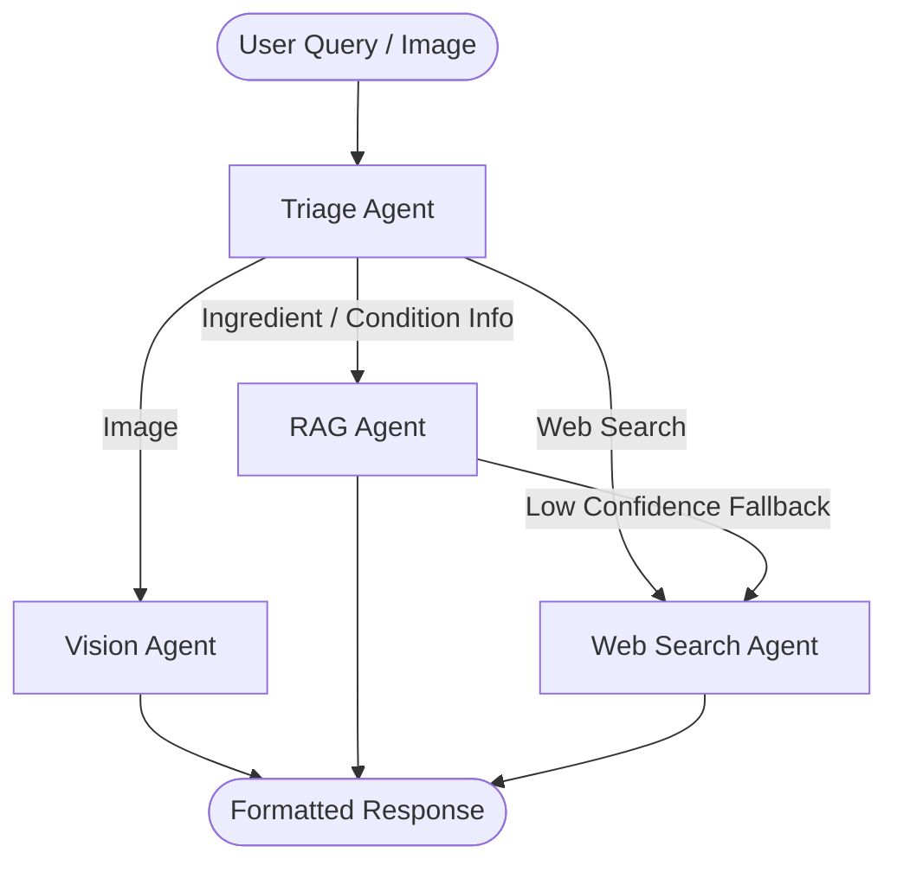

# DermaFlow AI

DermaFlow AI is a premium, state-of-the-art dermatology AI assistant built with Next.js, FastAPI, LangGraph, Pinecone, and Google Gemini. It triages user queries, retrieves verified medical knowledge (RAG), searches the web for recent info, and analyzes skin lesion features from uploaded images.

## Architecture



- **Frontend**: Next.js 16 (React 19), styled with Vanilla CSS and Tailwind v4. It features a luxury skincare brand design inspired by Figma screenshots, with glassmorphism, floating blur effects, and smooth animations.
- **Backend**: FastAPI app orchestrated by LangGraph representing a custom multi-agent routing graph.
- **Database**: MongoDB for session history storage, and Pinecone vector database for medical context embeddings.
- **AI Models**: Google Gemini (`gemini-2.5-flash`) for clinical triaging, vision analysis, and text response generation.

## Local Setup

### 1. Backend

1. Install requirements:
   ```bash
   pip install -r requirements.txt
   ```
2. Configure `.env` in the root directory:
   ```env
   GEMINI_API_KEY=your-gemini-api-key
   PINECONE_API_KEY=your-pinecone-api-key
   PINECONE_INDEX_NAME=dermaflow
   LANGCHAIN_API_KEY=your-langchain-api-key
   TAVILY_API_KEY=your-tavily-api-key
   MONGO_URI=your-mongodb-uri
   ```
3. Run the FastAPI development server:
   ```bash
   python -m uvicorn api.main:app --reload --port 8000
   ```

### 2. Frontend

1. Navigate to the `frontend/` folder:
   ```bash
   cd frontend
   ```
2. Install dependencies:
   ```bash
   npm install
   ```
3. Configure environment variables in `frontend/.env.local`:
   ```env
   NEXT_PUBLIC_API_URL=http://localhost:8000/api/v1
   ```
4. Run the development server:
   ```bash
   npm run dev
   ```
5. Open [http://localhost:3000](http://localhost:3000) in your browser.

## Deployment to Vercel

### Option A: Monorepo Deployment (All-in-One Vercel)

We have configured `vercel.json` in the root directory. To deploy both the Next.js frontend and the FastAPI backend together on Vercel:

1. Push this project repository to GitHub, GitLab, or Bitbucket.
2. In Vercel, click **Add New** -> **Project** and import your repository.
3. Keep the Root Directory as `.` (the project root).
4. Add all environment variables in Vercel settings (e.g. `GEMINI_API_KEY`, `PINECONE_API_KEY`, `PINECONE_INDEX_NAME`, `LANGCHAIN_API_KEY`, `TAVILY_API_KEY`, `MONGO_URI`).
5. Click **Deploy**. Vercel will automatically build the Next.js app inside `frontend/` and build `api/main.py` using Vercel's Python serverless runtime.

> [!NOTE]
> Vercel's Free/Hobby plan has a serverless function timeout of 10 seconds. If complex agent chains (especially web search + vision) exceed 10 seconds, Vercel might abort the request. If you encounter timeouts, proceed to Option B.

### Option B: Separate Frontend and Backend (Recommended for Production)

For robust production hosting with no execution timeouts on the backend:

1. **Deploy FastAPI Backend to Render/Railway**:
   - Create a Web Service on Render/Railway using the root directory.
   - Start Command: `python -m uvicorn api.main:app --host 0.0.0.0 --port $PORT`
   - Set env variables on the service.
2. **Deploy Next.js Frontend to Vercel**:
   - Import your repository to Vercel, but select **Root Directory** as `frontend`.
   - Set the environment variable `NEXT_PUBLIC_API_URL` to your Render/Railway backend URL (e.g. `https://dermaflow-backend.onrender.com/api/v1`).
   - Click **Deploy**.
